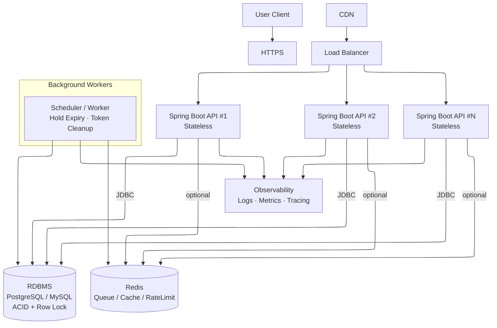

## 인프라 구성도

### 1) User Client
- 역할 : 사용자 요청

### 2) CDN (선택)
- 역할 : 정적 리소스(웹 프론트), TLS 일부 처리, 엣지 캐싱
- 설계 이유:
  - 정적 파일이 있다면 앱 인스턴스 부담 감소
  - API만 있다면 생략 가능

### 3) Load Balancer
- 역할: 트래픽 분산, 헬스체크, 라우팅
- 설계 이유:
  - 트래픽 증가 시 수평 확장 가능

### 4) Spring Boot API(Stateless)
- 역할 : API 처리(대기열 검증, 좌석 예약, 포인트 충전 및 차감, 결제)

### 5) RDBMS (PostgreSQL/MySQL)
- 역할: 좌석 예약 만료시간, 결제, 포인트, 대기열 토큰 상태 저장

### 6) Redis(선택)
- 역할 : 대기열 고도화

### 7) Scheduler/Worker
- 역할: 좌석 예약 만료 처리 (expires_at 초과한 좌석을 AVAILABLE 상태로 전환)
- 